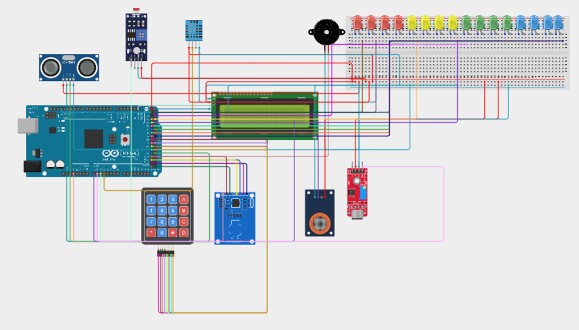

# 🌡️ Statie Multi-Senzor Inteligenta

---

# 📖 Descriere

Acest proiect a fost realizat in cadrul disciplinei **Componente si Circuite Pasive (CCP)** din cadrul Facultatii de Electronica, Telecomunicatii si Tehnologia Informatiei.

Aplicatia consta intr-o statie multisenzor inteligenta dezvoltata pe platforma **Arduino Mega 2560**, care integreaza mai multi senzori si periferice intr-un singur sistem embedded.

Accesul la functionalitatile statiei este protejat prin autentificare RFID, iar dupa validarea utilizatorului acesta poate selecta diferite moduri de functionare utilizand o tastatura matriciala. Sistemul permite monitorizarea parametrilor de mediu, masurarea distantei, detectarea nivelului sonor, evaluarea concentratiei alcoolului si afisarea informatiilor pe un ecran LCD.

Proiectul evidentiaza integrarea mai multor senzori si module electronice intr-o singura aplicatie, demonstrand dezvoltarea unui sistem embedded complex si modular. :contentReference[oaicite:1]{index=1}

---

# 🔧 Componente utilizate

- Arduino Mega 2560
- Modul RFID RC522
- Senzor alcool MQ-3
- Senzor ultrasonic HC-SR04
- Senzor sunet GY-MAX4466
- Senzor temperatura si umiditate DHT11
- Fotorezistor (LDR)
- LCD 16x2 cu interfata I2C
- Tastatura matriciala 4x4
- Buzzer
- 16 LED-uri
- Breadboard
- Fire de conexiune

---

# ⚙️ Functionalitati

- Autentificare utilizator prin RFID.
- Memorarea unui card autorizat.
- Meniu interactiv controlat prin keypad.
- Masurarea distantei utilizand HC-SR04.
- Monitorizarea nivelului sonor.
- Afisarea temperaturii si umiditatii.
- Monitorizarea luminozitatii ambientale.
- Etilotest digital utilizand senzorul MQ-3.
- Afisarea informatiilor pe LCD.
- Semnalizare luminoasa si acustica.

---

# 📂 Continutul proiectului

| Fisier | Descriere |
|---------|-----------|
| Cod Sursa.txt | Codul sursa Arduino |
| Schema.png | Schema electrica |
| Demo.mp4 | Demonstratie video |
| Documentatie.pdf | Documentatia completa |

---

# ▶️ Demonstratie

Proiectul include un videoclip demonstrativ (**Demo.mp4**) care prezinta autentificarea prin RFID, navigarea prin meniul aplicatiei si functionarea fiecarui modul al statiei multisenzor.

Explicatiile complete privind implementarea proiectului sunt disponibile in fisierul **Documentatie.pdf**.

---

# 👨‍💻 Autor

**Daniel Petrescu**

Facultatea de Electronica, Telecomunicatii si Tehnologia Informatiei

Universitatea Nationala de Stiinta si Tehnologie POLITEHNICA Bucuresti