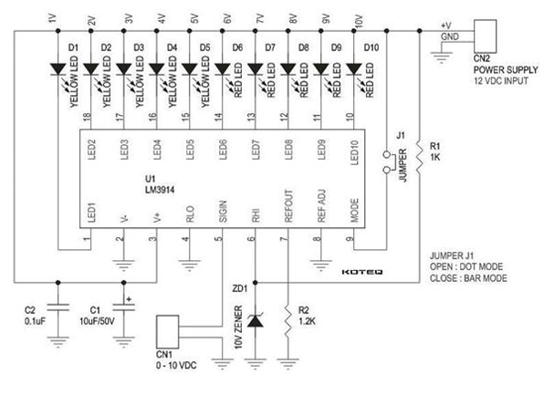

# ⚡ Indicator de Voltaj (0–10 V)

---

# 📖 Descriere

Acest proiect a fost realizat in cadrul disciplinei **Proiectare Asistata de Calculator (CAD/PCADE)** din cadrul Facultatii de Electronica, Telecomunicatii si Tehnologia Informatiei.

Proiectul consta in proiectarea completa a unui modul electronic pentru monitorizarea si afisarea unei tensiuni continue cuprinse intre **0 V si 10 V**, utilizand circuitul integrat **LM3914**.

Circuitul afiseaza nivelul tensiunii prin intermediul unei bare formate din 10 LED-uri, fiecare LED reprezentand aproximativ un prag de 1 V. Utilizatorul poate selecta doua moduri de afisare:

- **BAR** – toate LED-urile pana la nivelul masurat sunt aprinse;
- **DOT** – este aprins doar LED-ul corespunzator nivelului de tensiune.

Pe langa proiectarea schemei electrice, proiectul include realizarea layout-ului PCB, verificarea regulilor de proiectare si generarea documentatiei necesare fabricatiei. :contentReference[oaicite:1]{index=1}

---

# 🔧 Tehnologii si componente utilizate

- OrCAD Capture
- OrCAD PCB Editor
- LM3914
- 10 LED-uri
- Dioda Zener 10 V
- Rezistente
- Condensatoare
- Jumper pentru selectarea modului BAR/DOT
- Conector alimentare 12 V
- Conector intrare 0–10 V

---

# ⚙️ Functionalitati

- Monitorizarea unei tensiuni continue intre 0 si 10 V.
- Afisarea nivelului tensiunii prin intermediul a 10 LED-uri.
- Selectarea modului BAR sau DOT.
- Proiectarea unei placi PCB pe doua straturi.
- Verificarea automata a regulilor de proiectare (DRC).
- Generarea Cross Reference (CR), Wirelist (WR) si Bill of Materials (BOM).
- Pregatirea documentatiei pentru fabricatia placii de circuit imprimat.

---

# 📂 Continutul proiectului

| Fisier | Descriere |
|---------|-----------|
| Continut Stick/ | Fisierele proiectului CAD (schema, PCB si documentatie de proiectare) |
| Schema.png | Schema electrica a circuitului |
| Demo.mp4 | Demonstratie video |
| Documentatie.pdf | Documentatia completa a proiectului |

---

# ▶️ Demonstratie

Videoclipul **Demo.mp4** prezinta functionarea prototipului si modul de afisare a nivelului tensiunii utilizand cele doua moduri de operare (BAR si DOT).

Informatii detaliate privind proiectarea schemei electrice, layout-ul PCB si documentatia tehnologica sunt disponibile in fisierul **Documentatie.pdf**.

---

# 👨‍💻 Autor

**Daniel Petrescu**

Facultatea de Electronica, Telecomunicatii si Tehnologia Informatiei

Universitatea Nationala de Stiinta si Tehnologie POLITEHNICA Bucuresti